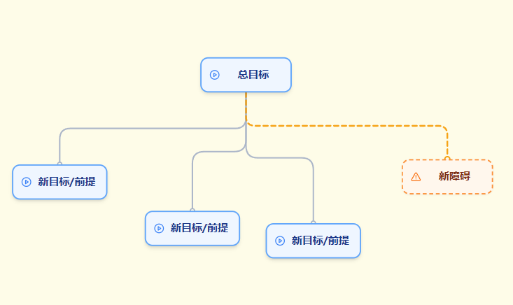
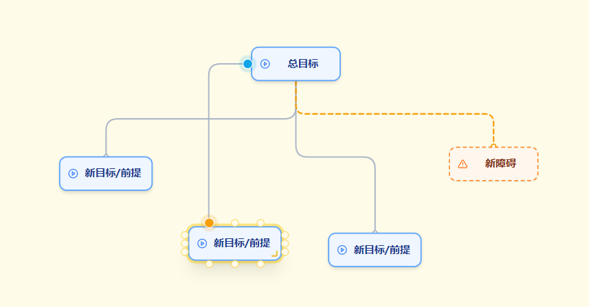
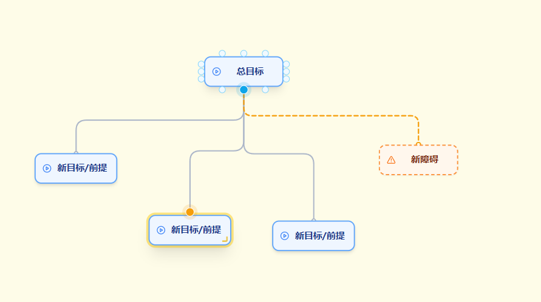

# Easy Goal Tracker

一个简约轻便的网页版 OKR / 目标拆解工具，用节点图的方式帮你梳理「总目标 – 子目标 – 前提 – 障碍」，支持导出 PNG 和 draw.io XML。

- 在线体验：<http://goal.the0xka1.cc/>
- GitHub 仓库：<https://github.com/The0xKa1/EasyGoalTracker>

---

## 功能

- 状态标记：支持「已完成 / 进行中 / 受阻碍」
- 智能布局：一键排版、智能选择新节点位置
- 框选移动：拖拽框选多个节点后整体移动
- 快速编辑：双击节点直接修改文字
- 锚点微调：可精细调整父子节点连线的位置
- 导出 PNG：方便贴到文档、PPT 或分享
- 与 draw.io 互通：导入 / 导出 `.drawio` / `.xml` 文件

---

## 界面预览

<div align="center">
  
  <p><em>基础目标树示例</em></p>
</div>

<div align="center">
  
  <p><em>选中节点后的操作菜单</em></p>
</div>

<div align="center">
  
  <p><em>选中节点后可看到连线锚点，用于微调连接位置</em></p>
</div>

<div align="center">
  
  <p><em>更换父节点 / 调整结构时的效果</em></p>
</div>

---

## 基本操作

- 画布平移：在空白区域按住鼠标左键拖拽
- 画布缩放：滚轮滚动进行缩放
- 编辑文字：双击任意节点即可修改文本
- 新增总目标：使用顶部工具栏中的「新增总目标」按钮
- 新增子目标 / 障碍：选中节点后，使用下方菜单中的「加子节点 / 加障碍」
- 修改状态：在节点下方菜单中选择「已完成 / 进行中 / 受阻碍」
- 删除节点：在节点下方菜单中点击删除按钮
- 更换父节点：进入「更换父节点模式」后，依提示点击锚点完成重新连线

> 提示：鼠标悬停在选中的子节点上，会出现父子节点连线的锚点，点击即可改变连线连接的位置，让整体结构更美观。

---

## 导入 / 导出

- 导出 PNG：
  - 使用顶部工具栏中的「导出为 PNG」按钮
  - 生成的图片可直接用于文档、汇报或分享
- 导出 draw.io：
  - 使用「导出 draw.io」按钮，获得 `.drawio` XML 文件
  - 可在 draw.io / diagrams.net 中继续编辑
- 导入 draw.io / XML：
  - 使用「导入 draw.io」按钮选择 `.drawio` 或 `.xml` 文件
  - 应用会自动解析并还原为当前画布的节点结构

---

## 本地开发

```powershell
npm install
npm run dev
```

默认开发地址通常是：<http://localhost:5173>

---

## 许可证

本项目仅用于个人 / 学习用途，如需在生产环境或商业场景中使用，请自行评估风险并遵守相关法律法规。
